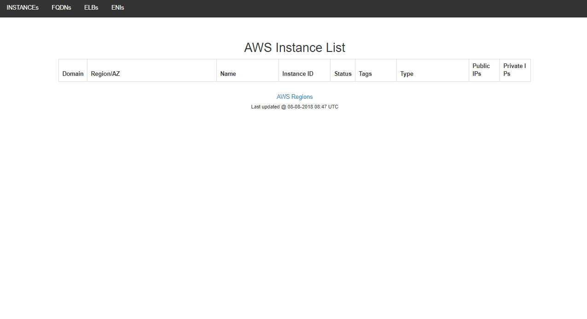

# KACL
A user friendly gui that you can search AWS items(instances, elbs, fqdns, network interfaces) quickly that are on multiple accounts and regions.

It's really hard to find any IP, ELB or FQDN, when you have lots of customer on different AWS accounts and regions. This tool will help you find the items quickly.

Just add all you wanted AWS credentials as below to bash scripts and compose docker(docker-compose up -d).
```
generate_list <account_name> <account-id> <default_region> <access_key> <secret_key>
```


High-level diagram:


Folder tree:
```
├── cron
│   ├── crontab
│   ├── Dockerfile
│   └── scripts
│       ├── elb.sh
│       ├── eni.sh
│       ├── fqdn.sh
│       └── instance.sh
├── data
│   ├── elb.php
│   ├── eni.php
│   ├── fqdn.php
│   └── index.php
└── docker-compose.yml

```
