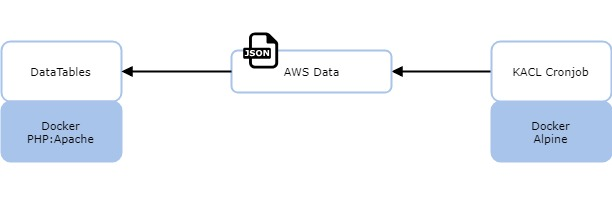

# KACL
a simple gui that combines AWS items on different accounts and regions

+-- cron
¦   +-- crontab
¦   +-- Dockerfile
¦   +-- scripts
¦       +-- elb.sh
¦       +-- eni.sh
¦       +-- fqdn.sh
¦       +-- instance.sh
+-- data
¦   +-- elb.php
¦   +-- eni.php
¦   +-- fqdn.php
¦   +-- index.php
+-- docker-compose.yml
